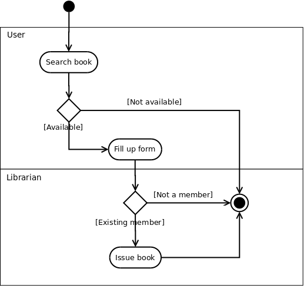

## Case Study

**1. A Library Information System for SE VLabs Institute**

The SE VLabs Institute has been recently setup to provide state-of-the-art research facilities in the field of Software Engineering. Apart from research scholars (students) and professors, it also includes quite a large number of employees who work on different projects undertaken by the institution.

As the size and capacity of the institute is increasing with the time, it has been proposed to develop a Library Information System (LIS) for the benefit of students and employees of the institute. LIS will enable the members to borrow a book (or return it) with ease while sitting at his desk/chamber. The system also enables a member to extend the date of his borrowing if no other booking for that particular book has been made. For the library staff, this system aids them to easily handle day-to-day book transactions. The librarian, who has administrative privileges and complete control over the system, can enter a new record into the system when a new book has been purchased, or remove a record in case any book is taken off the shelf. Any non-member is free to use this system to browse/search books online. However, issuing or returning books is restricted to valid users (members) of LIS only.

From the given problem we can identify at least four different functionality offered by the system:

- Register a new member
- Issue book
- Reissue book
- Update inventory

To begin with, let's consider the activity diagram for user registration, as shown in figure - 06.

 Figure-06: Activity diagram for new user registration

A new user fills up the registration form for library membership (either online or in paper), and submits to the librarian. Of course, an already registered user can't create another account for himself (or, herself). For users' who don't have an account already and have submitted their registration forms, the librarian verifies the information provided, possibly against the central database used by the institution. If all information have been provided correctly, librarian goes on with creating a new account for the user. Otherwise, the user is asked to provide all and correct information in his (her) registration form. Once a new account has been created for the user, he (she) is being issued an ID card, which is to be provided for any future transaction in the library.

Note that in the above diagram two swim lanes haven been shown indicated by the labels User and Librarian. The activities have been placed in swim lanes that correspond to the relevant role.

One of the major events that occur in any library is issue of books to it's members. Figure-07 tries to depict the workflow involved while issuing books.

 Figure-07: Activity diagram for issuing books

Now let's focus on figure-08, which shows the typical workflow of inventory update by the librarian. Note that since these are the tasks performed only by the librarian (and no one else plays a role), we skip the swim lanes.

 Figure-08: Activity diagram for updating inventory

Addition of new books and removing records of books taken off from the shelves could be done parallely. This means, one doesn't have to complete the task of addition of all new books before doing any removal. Merging of these two activities and the subsequent Update inventory activity indicates that it is not required to complete all addition and removals before proceeding to update the database. That is, a few books could be added, then update the database, then again continue with the tasks.

Finally, the workflow terminates when all addition and removal tasks have been completed.