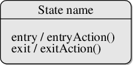

## Introduction 

Capturing the dynamic view of a system is very important for a developer to develop the logic for a system. State chart diagrams and activity diagrams are two popular UML diagram to visualize the dynamic behavior of an information system.

In this experiment, we will learn about the different components of activity diagram and state chart diagram and how these can be used to represent the dynamic nature of an information system.

 

## Theory

### Statechart Diagrams

In case of Object Oriented Analysis and Design, a system is often abstracted by one or more classes with some well defined behaviour and states. A statechart diagram is a pictorial representation of such a system, with all it's states, and different events that lead transition from one state to another.

To illustrate this, consider a computer. Some possible states that it could have are: running, shutdown, hibernate. A transition from running state to shutdown state occur when user presses the "Power off" switch, or clicks on the "Shut down" button as displayed by the OS. Here, clicking on the shutdown button, or pressing the power off switch act as external events causing the transition.

Statechart diagrams are normally drawn to model the behaviour of a complex system. For simple systems this is optional.

### Building Blocks of a Statechart Diagram

#### State
A state is any "distinct" stage that an object (system) passes through in it's lifetime. An object remains in a given state for finite time until "something" happens, which makes it to move to another state.  All such states can be broadly categorized into following three types:

- **Initial:** The state in which an object remain when created
- **Final:** The state from which an object do not move to any other state [optional]
- **Intermediate:** Any state, which is neither initial, nor final
As shown in figure-01, an initial state is represented by a circle filled with black. An intermediate state is depicted by a rectangle with rounded corners. A final state is represented by a unfilled circle with an inner black-filled circle.

 Figure-01: Representation of initial, intermediate, and final states of a statechart diagram

Intermediate states usually have two compartments, separated by a horizontal line, called the name compartment and internal transitions compartment [iv]. They are described below:

- **Name compartment:** Contains the name of the state, which is a short, simple, descriptive string
- **Internal transitions compartment:** Contains a list of internal activities performed as long as the system is in this state.

The internal activities are indicated using the following syntax: action-label / action-expression. Action labels could be any condition indicator. There are, however, four special action labels:

- **Entry:** Indicates activity performed when the system enter this state
- **Exit:** Indicates activity performed when the system exits this state
- **Do:** indicate any activity that is performed while the system remain in this state or until the action expression results in a completed computation
- **Include:** Indicates invocation of a sub-machine

Any other action label identify the event (internal transition) as a result of which the corresponding action is triggered. Internal transition is almost similar to self transition, except that the former doesn't result in execution of entry and exit actions. That is, system doesn't exit or re-enter that state. Figure-02 shows the syntax for representing a typical (intermediate) state

 Figure-02: A typical state in a statechart diagram

States could again be either simple or composite (a state congaing other states). Here, however, we will deal only with simple states.

#### Transition
Transition is movement from one state to another state in response to an external stimulus (or any internal event). A transition is represented by a solid arrow from the current state to the next state. It is labeled by: event [guard-condition]/[action-expression], where

- **Event** is the what is causing the concerned transition (mandatory) -- Written in past tense [iii]
- **Guard-condition** is (are) precondition(s), which must be true for the transition to happen [optional]
- **Action-expression** indicate action(s) to be performed as a result of the transition [optional]

It may be noted that if a transition is triggered with one or more guard-condition(s), which evaluate to false, the system will continue to stay in the present state. Also, not all transitions do result in a state change. For example, if a queue is full, any further attempt to append will fail until the delete method is invoked at least once. Thus, state of the queue doesn't change in this duration.

#### **Action**
As mentioned in [ii], actions represents behaviour of the system. While the system is performing any action for the current event, it doesn't accept or process any new event. The order in which different actions are executed, is given below:

1. Exit actions of the present state
2. Actions specified for the transition
3. Entry actions of the next state

Figure-03 shows a typical statechart diagram with all it's syntaxes.

 Figure-03: A statechart diagram showing transition from state A to B

## Guidelines for drawing Statechart Diagrams
Following steps could be followed, as suggested in [1] to draw a statechart diagram:

- For the system to developed, identify the distinct states that it passes through
- Identify the events (and any precondition) that cause the state transitions. Often these would be the methods of a class as identified in a class diagram.
- Identify what activities are performed while the system remains in a given state

## Activity Diagrams
Activity diagrams fall under the category of behavioural diagrams in Unified Modeling Language. It is a high level diagram used to visually represent the flow of control in a system. It has similarities with traditional flow charts. However, it is more powerful than a simple flow chart since it can represent various other concepts like concurrent activities, their joining, and so on [7,8] .

Activity diagrams, however, cannot depict the message passing among related objects. As such, it can't be directly translated into code. These kind of diagrams are suitable for confirming the logic to be implemented with the business users. These diagrams are typically used when the business logic is complex. In simple scenarios it can be avoided entirely [9].

## Components of an Activity Diagram
Below we describe the building blocks of an activity diagram.

### Activity
An activity denotes a particular action taken in the logical flow of control. This could simply be invocation of a mathematical function, alter an object's properties and so on [10]. An activity is represented with a rounded rectangle, as shown in table-01. A label inside the rectangle identifies the corresponding activity.

There are two special type of activity nodes: initial and final. They are represented with a filled circle, and a filled in circle with a border respectively (table-01). Initial node represents the starting point of a flow in an activity diagram. There could be multiple initial nodes, which means that invoking that particular activity diagram would initiate multiple flows.

A final node represents the end point of all activities. Like an initial node, there could be multiple final nodes. Any transition reaching a final node would stop all activities.

### Flow
A flow (also termed as edge, or transition) is represented with a directed arrow. This is used to depict transfer of control from one activity to another, or to other types of components, as we will see below. A flow is often accompanied with a label, called the guard condition, indicating the necessary condition for the transition to happen. The syntax to depict it is [guard condition].

### Decision
A decision node, represented with a diamond, is a point where a single flow enters and two or more flows leave. The control flow can follow only one of the outgoing paths. The outgoing edges often have guard conditions indicating true-false or if-then-else conditions. However, they can be omitted in obvious cases. The input edge could also have guard conditions. Alternately, a note can be attached to the decision node indicating the condition to be tested.

### Merge
This is represented with a diamond shape, with two or more flows entering, and a single flow leaving out. A merge node represents the point where at least a single control should reach before further processing could continue.

### Fork
Fork is a point where parallel activities begin. For example, when a student has been registered with a college, he can in parallel apply for student ID card and library card. A fork is graphically depicted with a black bar, with a single flow entering and multiple flows leaving out.

### Join
A join is depicted with a black bar, with multiple input flows, but a single output flow. Physically it represents the synchronization of all concurrent activities. Unlike a merge, in case of a join all of the incoming controls must be completed before any further progress could be made. For example, a sales order is closed only when the customer has receive the product, and the sales company has received it's payment.

### Note
UML allows attaching a note to different components of a diagram to present some textual information. The information could simply be a comment or may be some constraint. A note can be attached to a decision point, for example, to indicate the branching criteria.

### Partition
Different components of an activity diagram can be logically grouped into different areas, called partitions or swimlanes. They often correspond to different units of an organization or different actors. The drawing area can be partitioned into multiple compartments using vertical (or horizontal) parallel lines. Partitions in an activity diagram are not mandatory.

The following table shows commonly used components with a typical activity diagram.

 Figure-05: A simple activity diagram.

Apart from the above stated components, there are few other components as well (representing events, sending of signals, nested activity diagrams), which won't be discussed here. The reader is suggested to go through [10] for further knowledge.

#### A Simple Example
Figure-04 shows a simple activity diagram with two activities. The figure depicts two stages of a form submission. At first a form is filled up with relevant and correct information. Once it is verified that there is no error in the form, it is then submitted. The two other symbols shown in the figure are the initial node (dark filled circle), and final node (outer hollow circle with inner filled circle). It may be noted that there could be zero or more final node(s) in an activity diagram [9].

 Figure-05: A simple activity diagram.

## Guidelines for drawing an Activity Diagram
The following general guidelines could be followed to pictorially represent a complex logic.

- Identify tiny pieces of work being performed by the system
- Identify the next logical activity that should be performed
- Think about all those conditions that should be made, and all those constraints that should be satisfied, before one can move to the next activity
- Put non-trivial guard conditions on the edges to avoid confusion

## Case Study

1. A Library Information System for SE VLabs Institute
The SE VLabs Institute has been recently setup to provide state-of-the-art research facilities in the field of Software Engineering. Apart from research scholars (students) and professors, it also includes quite a large number of employees who work on different projects undertaken by the institution.

As the size and capacity of the institute is increasing with the time, it has been proposed to develop a Library Information System (LIS) for the benefit of students and employees of the institute. LIS will enable the members to borrow a book (or return it) with ease while sitting at his desk/chamber. The system also enables a member to extend the date of his borrowing if no other booking for that particular book has been made. For the library staff, this system aids them to easily handle day-to-day book transactions. The librarian, who has administrative privileges and complete control over the system, can enter a new record into the system when a new book has been purchased, or remove a record in case any book is taken off the shelf. Any non-member is free to use this system to browse/search books online. However, issuing or returning books is restricted to valid users (members) of LIS only.

From the given problem we can identify at least four different functionality offered by the system:

- Register a new member
- Issue book
- Reissue book
- Update inventory

To begin with, let's consider the activity diagram for user registration, as shown in figure - 06.

 Figure-06: Activity diagram for new user registration

A new user fills up the registration form for library membership (either online or in paper), and submits to the librarian. Of course, an already registered user can't create another account for himself (or, herself). For users' who don't have an account already and have submitted their registration forms, the librarian verifies the information provided, possibly against the central database used by the institution. If all information have been provided correctly, librarian goes on with creating a new account for the user. Otherwise, the user is asked to provide all and correct information in his (her) registration form. Once a new account has been created for the user, he (she) is being issued an ID card, which is to be provided for any future transaction in the library.

Note that in the above diagram two swim lanes haven been shown indicated by the labels User and Librarian. The activities have been placed in swim lanes that correspond to the relevant role.

One of the major events that occur in any library is issue of books to it's members. Figure-07 tries to depict the workflow involved while issuing books.

 Figure-07: Activity diagram for issuing books

Now let's focus on figure-08, which shows the typical workflow of inventory update by the librarian. Note that since these are the tasks performed only by the librarian (and no one else plays a role), we skip the swim lanes.

 Figure-08: Activity diagram for updating inventory

Addition of new books and removing records of books taken off from the shelves could be done parallely. This means, one doesn't have to complete the task of addition of all new books before doing any removal. Merging of these two activities and the subsequent Update inventory activity indicates that it is not required to complete all addition and removals before proceeding to update the database. That is, a few books could be added, then update the database, then again continue with the tasks.

Finally, the workflow terminates when all addition and removal tasks have been completed.